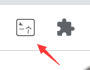
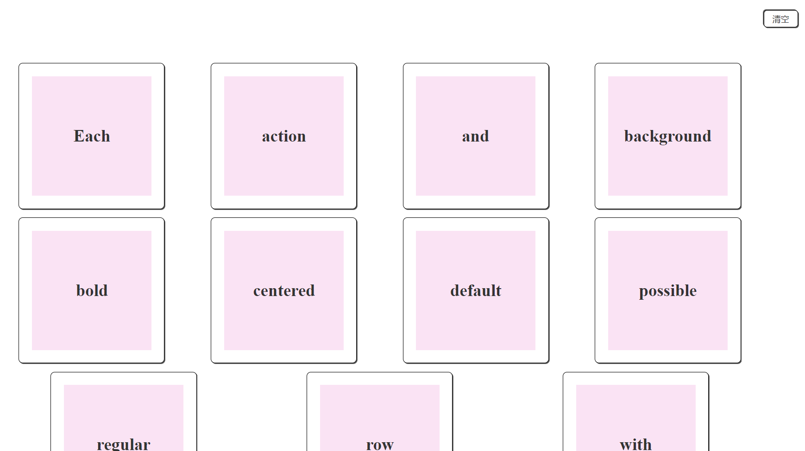
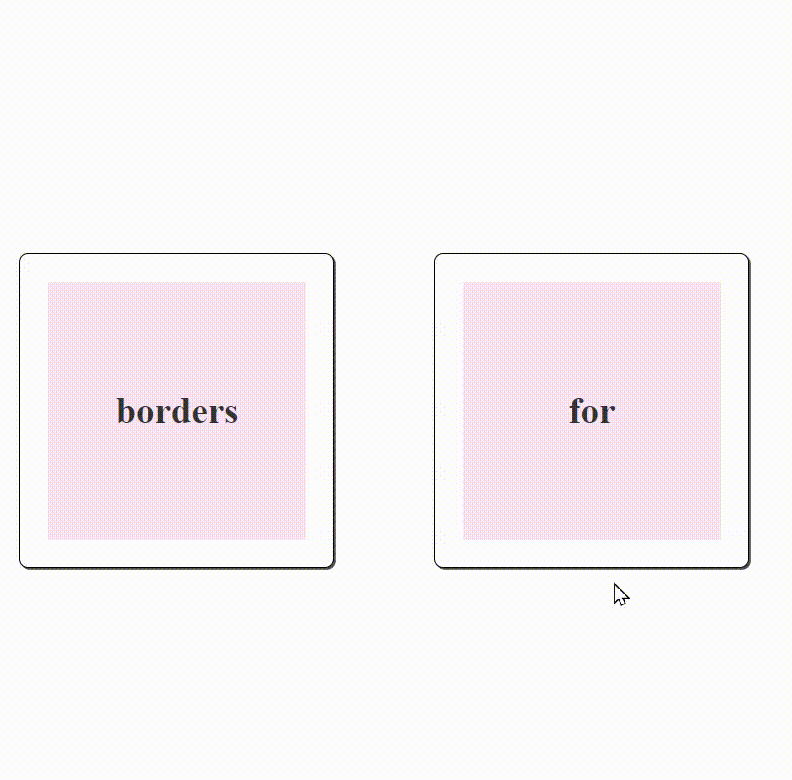
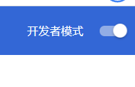
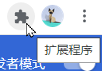
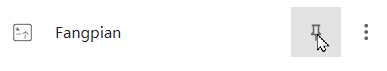

# Fangpian_Chrome
方片，纯粹的单词卡片（Chrome扩展）
A Chrome extension for Chinese to learn english words

   

本项目为《**方片**》系列第一个正式作品，是一个Chrome浏览器扩展（俗称”插件“）。

## 开始使用（Getting Started）

在任意页面（如果该页面在插件安装前已经加载过，需要刷新一下此页面），按住ctrl（Mac用户是cmd）键，用鼠标点击你要查的单词，片刻后会出现含有它的音标和释义的一张卡片。当需要关闭这个卡片的时候，只用点击一下卡片外的页面。

</img>

如果需要查看已经查询过的单词，只需要点击浏览器上方**方片**扩展的图标。

</img>

会自动在当前标签页右边打开一个新标签页查看所搜集过的单词卡片。

</img>

页面右上角的**清空**按钮，为这些卡片提供了**一键删除**功能。（注意！这个删除是不可逆的，操作前需考虑好。）

在每个单词卡**侧边**点击，会翻转卡片。正面为单词，背面为音标和释义。

</img>

目前这些数据全部存储在你的电脑本地，不会向任何地方包括google传输这些单词数据。

## 安装方法（Installation）

1. 在Chrome浏览器地址栏输入`chrome://extensions/`，回车，来到扩展页面。

2. 确保右上角的**开发者模式**处于打开状态，如下图：

</img>

1. 从 [这里（若能访问github）](https://github.com/aiyamia/fangpian_chrome/releases) 或 [这里（若不能访问github）](https://gitee.com/aiyamia/fangpian_chrome/releases)下载最新发布的压缩包`fangpian_chrome.crx`文件。用鼠标将其拖入上面这个扩展页面，就会自动完成安装。

2. 若安装后在浏览器上方找不到该扩展，它可能是被折叠了。你需要点击下图这个标志展开扩展程序栏。

</img>

然后找到方片，如下图点击按钮将其**固定**。

</img>

这样它就会待在你的Chrome浏览器上方了。

</img>

## 不止这些（There will be more）

2021年7月21日16:15:21 更新

如你所见，目前方片已经具备在本地存储数据的能力，也让用户能够查看自己的单词卡片了。

新的Todo:

1。在卡牌仓库页为卡片增加拖放、删除功能；

2。使卡片能够记录并展示用户查词时的上下文数据和时间，便于回顾；

3。为卡片数据增加云端存储能力

4。开发方片桌面版，增加对pdf中单词的查词功能。

在用户量积累到10人的时候：

1。考虑支持词组与句子

2。考虑支持多语种

---------------------以下是原po---------------------

本项目伊始，正在为其添加记录数据的能力，未来会让用户查看自己的单词卡片。

\### Todo:
1. 增加本地与云端两种数据存储模式
2. 设计卡牌UI与功能系统，探索是否可以游戏化
3. 开发方片桌面版，增加对pdf中单词的查词功能。

在用户量积累到10人的时候：
1. 考虑支持词组与句子
2. 考虑支持多语种

## 欢迎你的想法和体验（Your ideas matter）

感谢你能看到这里，你在使用中的任何想法都会被作者认真考虑。也欢迎和我一起来开发~

用户交流qq群：791712164

加群问题答案：mia