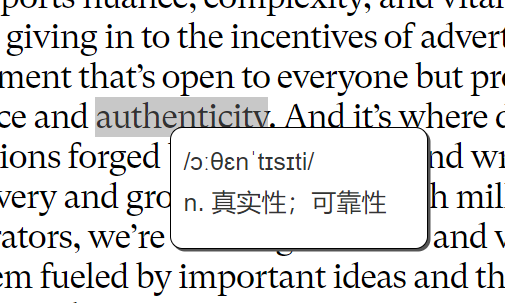

# fangpian_chrome
方片，纯粹的单词卡片（Chrome扩展） A Chrome extension for Chinese to learn english words

本项目是《**方片**》系列的第一个正式作品，是一个Chrome浏览器扩展（俗称”插件“）

## 安装方法（Installation）

1. 在Chrome浏览器里地址栏输入`chrome://extensions/` 回车，来到扩展页面。

2. 确保右上角的**开发者模式**处于打开状态，如下图：

3. 从 [这里](https://github.com/aiyamia/fangpian_chrome/releases/latest) 下载最新版压缩包，解压之后，将`README.md`文件上一级的**fangpian_chrome**文件夹用鼠标拖入上面这个扩展页面，就会自动完成安装。

4. 如果安装之后你在浏览器最上方找不到这个扩展，它可能被折叠了。你需要点击下图这个标志展开扩展程序栏

然后找到方片，如下图点击按钮将其**固定**。

这样它就会待在你的Chrome浏览器上方了。

## 开始使用（Getting Started）

来到含有你所要了解含义的词的任意页面（如果该页面在插件安装前已经加载过，需要刷新一下页面），按住ctrl（Mac用户是cmd）键，用鼠标点击这个词，片刻之后会出现这个词的音标和释义。

当你需要关闭这个卡片的时候，只需要点击一下卡片之外的页面。

## 不止这些（There will be more）

本项目伊始，正在为其添加记录数据的能力，未来会让用户查看自己的单词卡片。

## 欢迎你的想法和体验（Your ideas and experiences are wellcome）

你在使用中的任何想法都会被作者认真考虑。也欢迎和我一起来开发~
